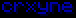
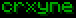
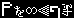

# MetaColor
Namecolor plugin for 1.19

In order to get access to any given name color, both the joindate requirement (JD min.) as well as the playtime requirement (PT min.) have to be fulfilled.
The playtime numbers here are measured in hours, whereas the joindate is either measured in days, or a certain date, where the player must have joined before it.

## Obtainable Namecolors for everyone
| color       | PT min. | JD min.      | example                       | hex code |
|-------------|---------|--------------|-------------------------------|----------|
| dark_red    | 500     | 70           |     | #AA0000  |
| blood_red   | 1000    | 100          |    | #660000  |
| red         | 20      | none         |          | #FF5555  |
| aero_orange | 200     | 60           |  | #FF4F00  |
| gold        | 10      | none         |         | #FFAA00  |
| yellow      | 30      | none         |       | #FFFF55  |
| aqua        | 70      | none         |         | #55FFFF  |
| dark_aqua   | 200     | Sep. 13 2023 |    | #00AAAA  |
| dark_blue   | 100     | 90           |    | #0000AA  |
| blue        | 5       | none         |         | #5555FF  |
| dark_purple | 15      | 0            |  | #AA00AA  |
| white       | 1       | none         |        | #FFFFFF  |
| gray        | none    | none         |         | #AAAAAA  |
| dark_gray   | 100     | 100          |    | #555555  |

| modifier   | PT min. | JD min.      | example                    | sample command                  |
|------------|---------|--------------|----------------------------|---------------------------------|
| bold       | 40      | 50           |      |
| italic     | none    | Aug. 20 2023 |    |
| gradient   | 5000    | 200          |  | /nc gradient dark_red dark_blue |
| flag       | 2500    | 150          |      | /nc flag denim white dark_red   |

## Donator Namecolors
Donators of the server may get special perks for namecolor selection, such as additional namecolors not every other player can have, or an instant access to colors that would require some PT or JD.

| color        | example                        | hex code |
|--------------|--------------------------------|----------|
| light_purple |  | #FF55FF  |
| dark_aqua    |     | #00AAAA  |

| modifier   | example                      |
|------------|------------------------------|
| italic     |      |
| underlined |  |

## Currently unobtainale Namecolors
These namecolors are not available to anyone except admins as of currently, but this may change in the future.

| color           | example                           | hex code |
|-----------------|-----------------------------------|----------|
| amaranth_purple |  | #AB274F  |
| peach           |            | #FFE5B4  |
| dark_green      |       | #00AA00  |
| green           |            | #55FF55  |
| myrtle_green    |     | #317873  |
| zomp            |             | #39A78D  |
| pacific_cyan    |     | #1CA9C9  |
| ultramarine     |      | #120A8F  |
| denim           |            | #1560BD  |
| indigo          |           | #4B0082  |
| byzantium       |        | #702963  |
| hot_pink        |         | #FF69B4  |
| cherry_blossom  |   | #FFB7C5  |
| dutch_white     |      | #EFDFBB  |
| silver          |           | #FCFCFC  |
| black           |            | #000000  |
| dark_brown      |       | #4B3621  |
| light_brown     |      | #964B00  |
| night           |            | #222222  |

| modifier      | example                         | sample command               |
|---------------|---------------------------------|------------------------------|
| strikethrough |  |
| alternating   |    | /nc alternating black white  |
| obfuscated    |     |